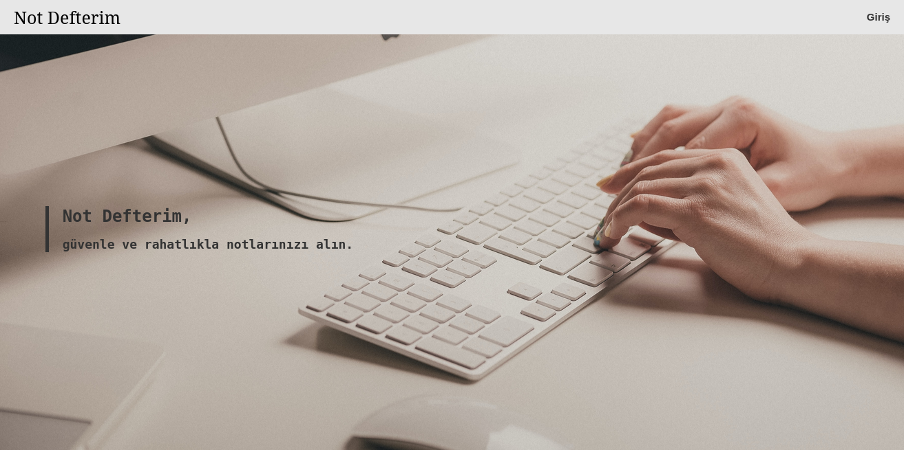
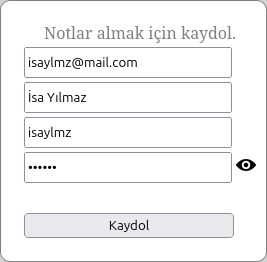
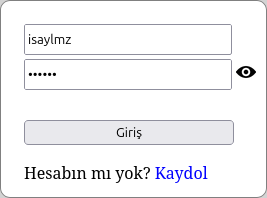
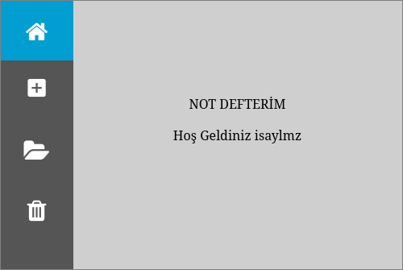
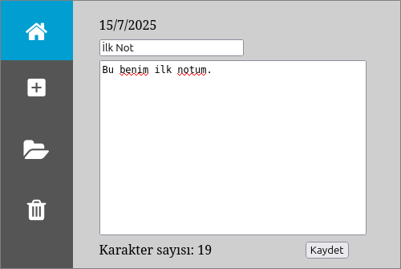
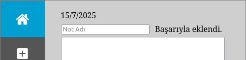
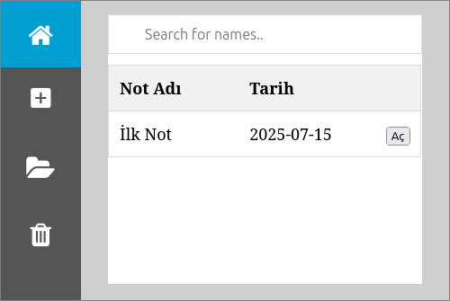
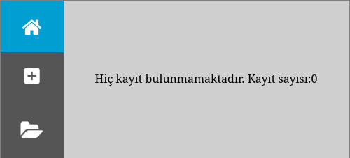

+ '**notdefterim.sql**' dosyasını kullanarak uygulamaya ait veri tabanını içeri aktarabilirsiniz.

+ Veri tabanı bağlantı bilgilerini "Not-Defterim/conn.php" dosyasından değiştirebilirsiniz.

```php
# conn.php bağlantı bilgileri.
$servername = "localhost";  
$username = "root";  
$password = "";  
$database = "basvuru";
```

---

### Ana Sayfa


---

### Kayıt Sayfası


**Çıktı:**


---

### Giriş Sayfası


---

### Kullanıcı Paneli


---

### Not Ekleme Sayfası


**Çıktı:**



---

### Not Listeleme Sayfası


---

### Not Silme Sayfası


**Çıktı:**

